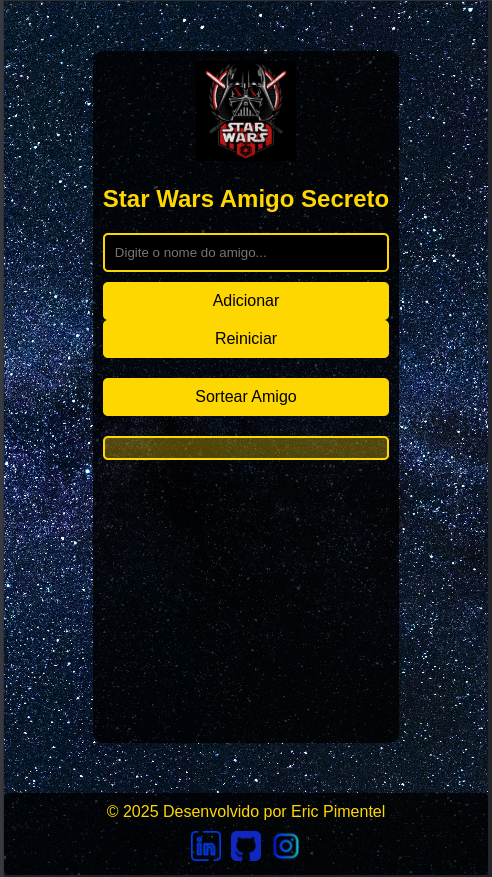

# Star Wars Amigo Secreto


## 🌟 Sobre o Projeto
Este projeto consiste em uma aplicação interativa que permite aos usuários realizar um sorteio de amigo secreto com tema inspirado no universo de **Star Wars**. A interface foi cuidadosamente projetada para proporcionar uma experiência divertida e imersiva, combinando funcionalidade e estética.

O objetivo é criar uma ferramenta simples e prática para organizar sorteios de amigo secreto entre amigos, familiares ou colegas, com um toque especial do universo de Star Wars.

---

## 🎯 Case Study
### Contexto
Em eventos sociais ou festas temáticas, o amigo secreto é uma atividade clássica que promove interação e diversão. Este projeto traz uma solução digital para facilitar o processo de sorteio, garantindo praticidade e imersão no tema Star Wars.

### Por que desenvolver esta aplicação?
- **Facilidade de uso:** Basta inserir os nomes dos participantes e realizar o sorteio.
- **Imersão temática:** O design e as interações são inspirados no universo de Star Wars, tornando a experiência mais envolvente.
- **Praticidade:** Elimina a necessidade de métodos manuais, como papéis ou planilhas, para realizar o sorteio.

---

## 🚀 Funcionalidades
- Adicionar nomes à lista de participantes.
- Validar entradas para evitar campos vazios.
- Exibir a lista de nomes adicionados em tempo real.
- Realizar o sorteio aleatório de um "amigo secreto".
- Reiniciar o sorteio para começar novamente.
- Interface responsiva para diferentes dispositivos.

---

## 🛠️ Tecnologias Utilizadas
- **HTML5:** Estrutura da página.
- **CSS3:** Estilização e tema Star Wars.
- **JavaScript:** Lógica do programa e interatividade.
- **GitHub Pages:** Hospedagem da aplicação.

---

## 📊 Visualizações
A aplicação apresenta diversas interações visuais que permitem explorar:
- Lista dinâmica de nomes adicionados.
- Resultado do sorteio exibido em destaque.
- Botões com feedback visual ao passar o mouse.

---

## 📸 Capturas de Telas
### Visão Geral da Aplicação
  
*Interface principal com campo de texto, botões e lista de nomes.*

### Sorteio de Amigo Secreto
  
*Interface principal, com campo de texto, botões e lista de nomes, com responsividade ativada.*

### Demonstração em Vídeo
https://private-user-images.githubusercontent.com/84017071/413661414-e7760612-533d-4c11-94b5-ca5306f6bfd8.mp4?jwt=eyJhbGciOiJIUzI1NiIsInR5cCI6IkpXVCJ9.eyJpc3MiOiJnaXRodWIuY29tIiwiYXVkIjoicmF3LmdpdGh1YnVzZXJjb250ZW50LmNvbSIsImtleSI6ImtleTUiLCJleHAiOjE3Mzk3NTMwMDQsIm5iZiI6MTczOTc1MjcwNCwicGF0aCI6Ii84NDAxNzA3MS80MTM2NjE0MTQtZTc3NjA2MTItNTMzZC00YzExLTk0YjUtY2E1MzA2ZjZiZmQ4Lm1wND9YLUFtei1BbGdvcml0aG09QVdTNC1ITUFDLVNIQTI1NiZYLUFtei1DcmVkZW50aWFsPUFLSUFWQ09EWUxTQTUzUFFLNFpBJTJGMjAyNTAyMTclMkZ1cy1lYXN0LTElMkZzMyUyRmF3czRfcmVxdWVzdCZYLUFtei1EYXRlPTIwMjUwMjE3VDAwMzgyNFomWC1BbXotRXhwaXJlcz0zMDAmWC1BbXotU2lnbmF0dXJlPTA4MDllYjc4NGE3MWZhYWYxZjA4MDQyOWIyOTNmNjhmYjRhYzIzN2U0NDY3NTk4NTk5ZDVlOTQ4OTU1YTZkMzMmWC1BbXotU2lnbmVkSGVhZGVycz1ob3N0In0.WMF3FLzk6dBTyHJZs5AZ0_VBut8l-XAQ4oK4hKBx-yk

*Vídeo demonstrando a inserção de nomes, sorteio e a responsividade sendo ativada.*

---

## 🎯 Desafios e Soluções
### Desafios Encontrados
1. **Responsividade**
   - Problema: Garantir que a aplicação fosse usável em diferentes tamanhos de tela.
   - Solução: Implementação de regras CSS `@media` queries e ajustes no layout.

2. **Validação de Entradas**
   - Problema: Evitar que nomes inválidos (vazios) fossem adicionados à lista.
   - Solução: Uso de validações em JavaScript antes de adicionar nomes ao array.

3. **Estilo Temático**
   - Problema: Criar uma interface visualmente alinhada com o tema Star Wars.
   - Solução: Uso de cores, fontes e imagens inspiradas no universo Star Wars.

4. **Funcionalidade de Reinicialização**
   - Problema: Permitir que o usuário reinicie o sorteio sem recarregar a página.
   - Solução: Implementação de uma função para limpar o array e atualizar a interface.

---

## 🚀 Como Executar
1. Clone o repositório
```bash
git clone https://github.com/enps2015/starwars-amigo-secreto.git
```

2. Abra o arquivo `index.html`
```bash
cd starwars-amigo-secreto
open index.html
```

3. Acesse no navegador
```
http://localhost:8080 (ou diretamente pelo arquivo aberto)
```

---

## 📈 Próximos Passos
### Melhorias Planejadas
1. **Animações**
   - Adicionar animações ao adicionar nomes e ao sortear o amigo secreto.
   - Efeitos visuais para destacar o resultado do sorteio.

2. **Persistência de Dados**
   - Salvar a lista de nomes localmente usando `localStorage` para evitar perda de dados ao recarregar a página.

3. **Exportação de Resultados**
   - Permitir que o usuário exporte a lista de nomes ou o resultado do sorteio como um arquivo `.txt`.

4. **Integração com APIs**
   - Usar APIs externas para gerar sugestões de presentes baseadas nos nomes dos participantes.

---

## 👨‍💻 Autor
---
**Desenvolvido por:**  
[](https://www.linkedin.com/in/eric-np-santos/) Eric Pimentel  
**Que a Força esteja com você! 🚀 ✨**

- Instagram: [@eric.n.pimentel](https://www.instagram.com/eric.n.pimentel/)  
- GitHub: [enps2015](https://github.com/enps2015)

---

> "Que a Força esteja com você!"

-
